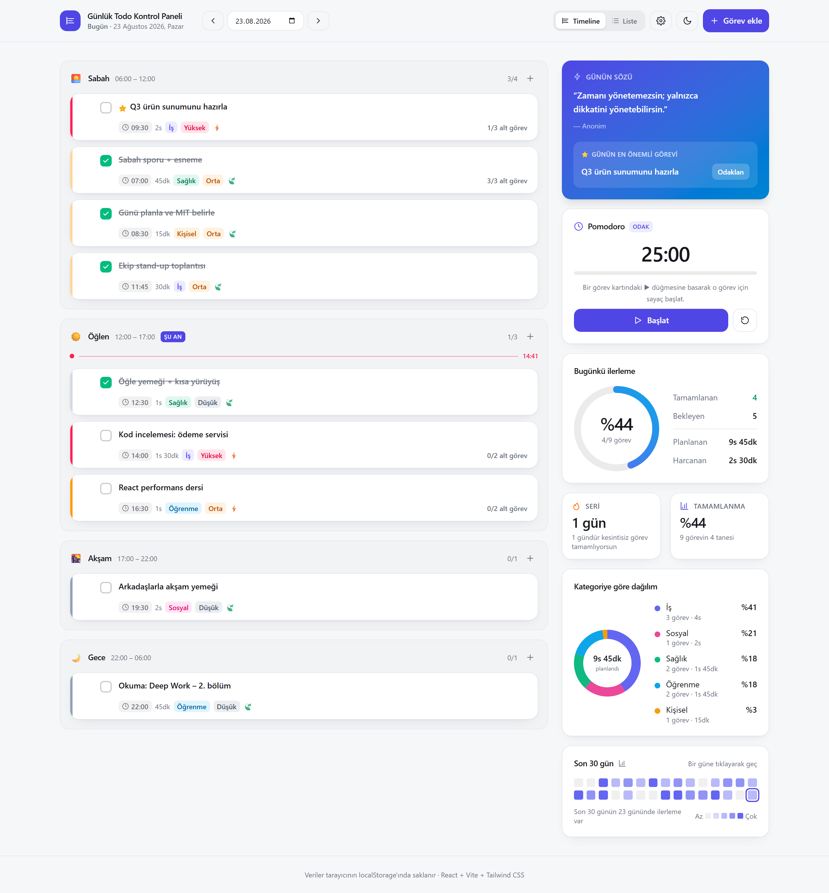
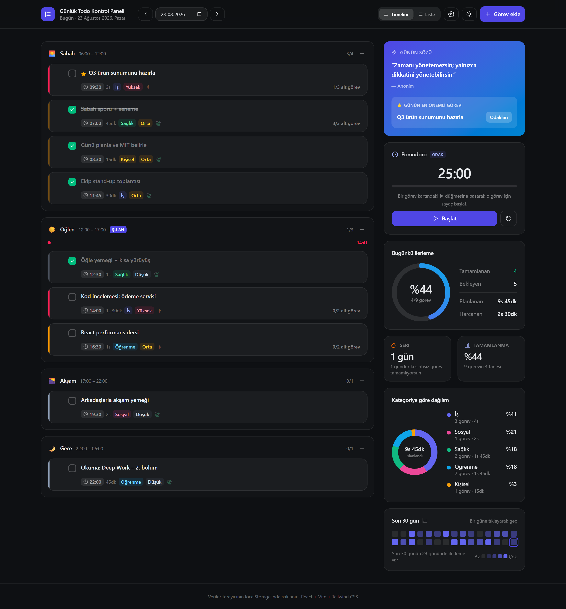
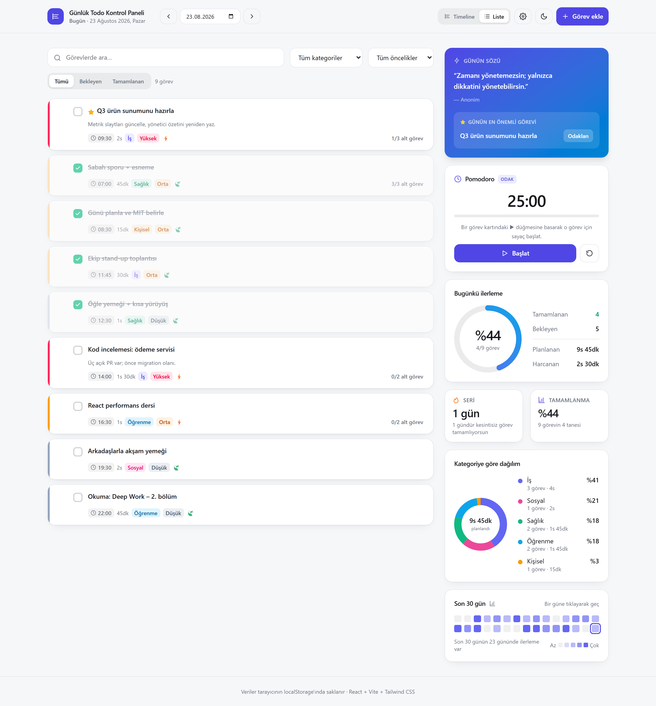
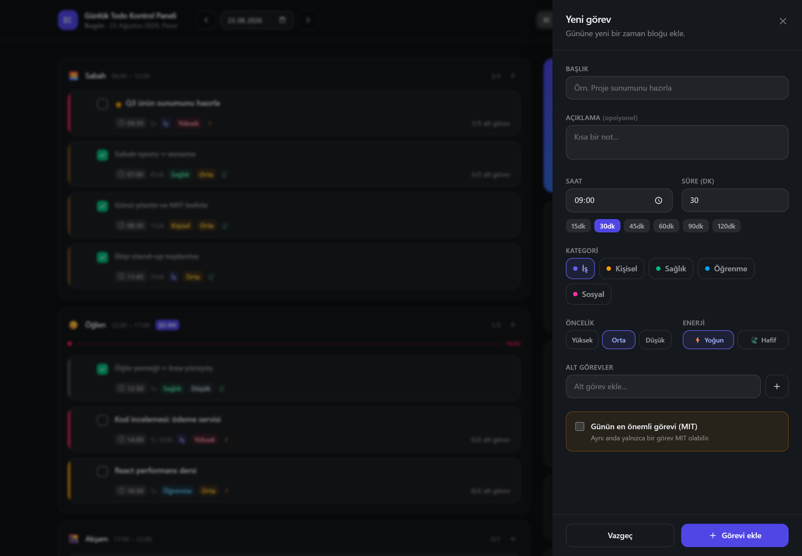
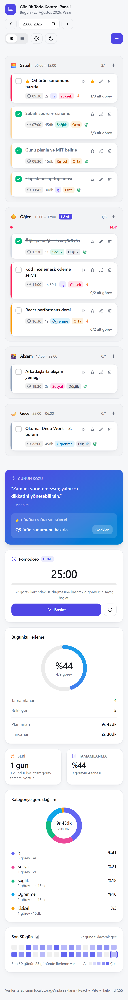

# Günlük Todo Kontrol Paneli

**🔗 Canlı demo: [gunluk-todo-paneli.vercel.app](https://gunluk-todo-paneli.vercel.app)**

Basit bir yapılacaklar listesinden fazlası: günün tamamını **zaman bloklarına** göre planlayan, üretkenliğini ölçen bir kontrol paneli. Backend yok — tüm veriler tarayıcının `localStorage`'ında, **tarih bazlı anahtarlarla** saklanır.



## İçindekiler

- [Canlı demo](https://gunluk-todo-paneli.vercel.app)
- [Özellikler](#özellikler)
- [Ekran görüntüleri](#ekran-görüntüleri)
- [Teknoloji yığını](#teknoloji-yığını)
- [Kurulum](#kurulum)
- [Klasör yapısı](#klasör-yapısı)
- [Veri modeli](#veri-modeli)
- [Deploy](#deploy)

## Özellikler

### CRUD işlemleri

| İşlem | Nasıl çalışır |
| --- | --- |
| **Ekle** | Sağdan açılan slide-over panel: başlık, açıklama, saat, süre, kategori, öncelik, enerji seviyesi, alt görevler ve MIT işareti |
| **Listele** | İki görünüm — saatlik/zaman bloklu **timeline** ve filtrelenebilir **düz liste** (arama + kategori + öncelik + durum) |
| **Güncelle** | Başlığa çift tıklayarak inline düzenleme, tek tıkla tamamlama, sürükle‑bırak ile zaman bloğu ve sıra değiştirme |
| **Sil** | Silme butonu + birkaç saniye içinde **"Geri Al"** bildirimi |

### Panel bileşenleri

- **Timeline görünümü** — Sabah / Öğlen / Akşam / Gece blokları, güncel saati gösteren canlı çizgi, bloklar arası sürükle‑bırak
- **Analitik paneli** — dairesel ilerleme göstergesi, seri (streak) sayacı, kategoriye göre süre dağılımı (donut), son 30 günün ısı haritası
- **Motivasyon kartı** — tarihe göre deterministik günün sözü + günün MIT (Most Important Task) vurgusu
- **Pomodoro** — bir görevin ▶ düğmesiyle 25 dakikalık sayaç; sekme arka plandayken de doğru sayar
- **Dark / Light mode** — Tailwind `dark:` sınıflarıyla, tercih `localStorage`'da saklanır, sayfa açılışında flash yaşanmaz
- **Ayarlar sayfası** — veri özeti, JSON olarak dışa aktarma, tüm verileri sıfırlama

### Erişilebilirlik ve detaylar

- Tüm etkileşimli öğelerde `aria-label` / `aria-pressed`, klavye ile sürükle‑bırak desteği
- `prefers-reduced-motion` desteği
- Mobil öncelikli responsive düzen — dar ekranda tek kolon, geniş ekranda içerik + yan panel
- Isı haritasındaki bir güne tıklayarak o günün planına geçiş

## Ekran görüntüleri

<table>
  <tr>
    <td width="50%"><br /><sub><b>Koyu tema — timeline görünümü</b></sub></td>
    <td width="50%"><br /><sub><b>Liste görünümü ve filtreler</b></sub></td>
  </tr>
  <tr>
    <td><br /><sub><b>Görev ekleme paneli</b></sub></td>
    <td><br /><sub><b>Mobil görünüm</b></sub></td>
  </tr>
</table>

## Teknoloji yığını

- **React 19** — Vite ile kurulum (CRA değil)
- **Tailwind CSS v4** — `@tailwindcss/vite` eklentisi, dark mode `class` stratejisi
- **JavaScript** (TypeScript değil — tip ipuçları JSDoc ile)
- **@dnd-kit** — sürükle‑bırak
- **localStorage** — tek veri kaynağı, backend/API yok

Grafikler harici bir kütüphane olmadan, **saf SVG** ile çizilir (donut, ilerleme halkası, ısı haritası).

## Kurulum

Node.js 20+ gerekir.

```bash
git clone <repo-url>
cd gunluk-todo-paneli

npm install      # bağımlılıkları kur
npm run dev      # geliştirme sunucusu — http://localhost:5173
npm run build    # dist/ altına production build
npm run preview  # build çıktısını yerelde önizle
npm run lint     # oxlint
```

## Klasör yapısı

```
src/
  components/    TaskCard, TaskFormPanel, TimelineView, ListView,
                 ProgressRing, Heatmap, CategoryChart, PomodoroWidget,
                 MotivationCard, AnalyticsPanel, FilterBar, UndoToast, …
  pages/         Dashboard.jsx, Settings.jsx
  hooks/         useLocalStorage.js, useTasks.js, usePomodoro.js, useTheme.js
  utils/         date.js (tarih işlemleri), storage.js (localStorage),
                 stats.js (istatistik hesaplamaları)
  constants/     kategoriler, öncelikler, zaman blokları, motivasyon sözleri
  App.jsx
  main.jsx
```

## Veri modeli

Her görev şu şekilde saklanır:

```js
{
  id: string,
  title: string,
  description: string,
  time: string,        // "09:00" — saatlik blok
  duration: number,    // dakika cinsinden tahmini süre
  category: string,    // "is" | "kisisel" | "saglik" | "ogrenme" | "sosyal"
  priority: "high" | "medium" | "low",
  energyLevel: "high" | "low",
  subtasks: [{ id, title, done }],
  completed: boolean,
  isMIT: boolean       // günün en önemli görevi
}
```

**localStorage anahtarları tarih bazlıdır:**

```
todos-2026-08-23   →  o güne ait görev dizisi
todo-theme         →  "light" | "dark"
todo-view          →  "timeline" | "list"
```

Bu sayede her günün verisi ayrı saklanır; geçmiş günlerin kayıtları **seri (streak)** ve **ısı haritası** hesaplarında kullanılır. Boş günler için anahtar yazılmaz.

## Deploy

Proje statik bir SPA'dır; Vercel, Netlify veya benzeri bir servise olduğu gibi çıkılabilir.

**Vercel:**

1. Repoyu GitHub'a public olarak yükle
2. [vercel.com/new](https://vercel.com/new) üzerinden repoyu içe aktar
3. Ayarlar otomatik algılanır (`vercel.json` ile birlikte gelir):
   - Framework: **Vite**
   - Build command: `npm run build`
   - Output directory: `dist`
4. **Deploy**

Ya da CLI ile:

```bash
npm i -g vercel
vercel --prod
```

---

Veriler yalnızca kullanıcının tarayıcısında tutulur; sunucuya hiçbir şey gönderilmez.
